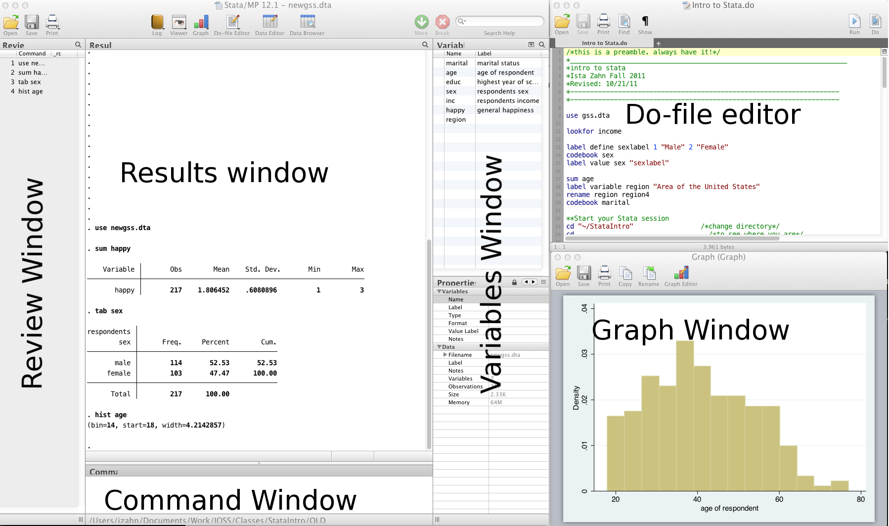

```{r, echo=FALSE, results=FALSE, eval=TRUE}
require(knitr)
knitr::opts_chunk$set(eval=FALSE, results=FALSE, message=FALSE, warning=FALSE, error=FALSE)
statapath <- "/Applications/Stata/StataMP.app/Contents/MacOS/stata-mp"
opts_chunk$set(engine="stata", engine.path=statapath, comment="")
```


# Stata Introduction

**Topics**

* Stata interface and Do-files
* Reading and writing data
* Basic summary statistics
* Basic graphs
* Basic data management
* Bivariate analyses 

## Setup

### Class Structure and organization 

* Informal --- Ask questions at any time. Really!
* Collaboration is encouraged - please spend a minute introducing yourself to your neighbors!
* If you are using a laptop, you will need to adjust file paths accordingly
* Make comments in your Do-file - save on flash drive or email to yourself


### Prerequisites

This is an introductory Stata course: 

* Assumes no prior knowledge of **how to use** Stata
* We do assume you know **why** you want to learn Stata. If you don't, and want a comparison of Stata to other statistical software, see our [Data Science Tools](./DataScienceTools.html) workshop
* Relatively slow-paced


### Goals


We will learn about the Stata language by analyzing data from the general social survey (gss).
In particular, our goals are:

1. Familiarize yourself with the Stata interface
2. Get data in and out of Stata
3. Compute statistics and construct graphical displays
4. Compute new variables and transformations
5. Perform univariate and bivariate data analyses 


## Stata basics 

* Used in a variety of disciplines
* User-friendly
* Great guides available on web
* Excellent modeling capabilities
* Student and other discount packages available at reasonable cost


## What is Stata? 

* Stata is a complete, integrated statistical software package that you can perform data analysis, data management, and create graphics
* Stata is commonly used among health, sociology, and economics researchers, particularly those working with large data sets 


## Why use Stata? 

* It is easy to learn and is supported by a wide range of introductory textbooks
* It offers a wide range of statistical analyses
* It has a great degree of flexibility
* It presents results in a clear format
* It is well-controlled by StataCorp so that one can have real faith in Stata’s results
* It has very good build-in help documentations and broad user community where you can seek for help
* Student and other discount packages available at reasonable cost


When Stata is running, variables, data, etc., are **stored in memory**. The user can use **clear** command to clear up memory before running further commands, unless they want to **save** their changes in the original dataset or in a new dataset. 


### Interfaces



* Review and Variable windows can be closed (user preference)
* Command window can be shortened (recommended)


### GUI, command window, and do-file

There are different ways of interacting with Stata. The three ways are through: 

1. **GUI**. The GUI makes commands you are using for the first time easier to learn by showing you the command and the proper syntax for the operation that you wish to perform.

2. **Command window**. From the command window you can type commands when you aren't using the GUI to manage and analyze your data. 
    + The pros to run your code in the command window is that you can quickly produce output of a single command. 
    + The cons to run your code in the command window is that you cannot properly store your syntax to reproduce in the future. 
    + Thus, we are introducing the third way, and if you want to develop reasonable expertise in        Stata, we always recommend the third way to write your code: 

3. **Do-file**. There are several advantages with using a do-file: 
    + Do-file allows you to submit more than one command to Stata at once 
    + Do-file has specialized features for programmers such as syntax highlighting, code folding, autocompletion, and bookmarks to important lines in your code, brace matching, and more 
    + With a do-file, it is easy to **save** your codes, **review** your codes, **change** your codes, and **share** your codes with others 


Here are some resources for learning more about Stata and Do-file: 

* <https://www.stata.com/>
* <https://www.stata.com/manuals13/gsw13.pdf>
* <https://sociology.fas.harvard.edu/files/sociology/files/creating_a_do_file.pdf>


### Stata help

To get help in Stata type `help` followed by topic or command, e.g., `help codebook`.

### Syntax rules

* Most Stata commands follow the same basic syntax: `Command varlist, options`.

* Use comments liberally --- start with a comment describing your Do-file and use comments throughout
   + Use '*' to comment a line and '//' for in-line comments
   + Use `///` to break varlists over multiple lines


### Exercise 0

1. Try to get Stata to say "hello world!". Search *help display*


```{stata}

```

2. Try to get Stata to break "Hello Worlds" over two lines:

```{stata}

```


### Let's get started - Launch a session

* Launch the Stata program (MP or SE, does not matter unless doing computationally intensive work)
    + Open up a new Do-file
    + Run our first Stata code!

Start Stata and locate/change the current working directory:

1. print current working directory 

```{stata}
pwd 

```

2. change working directory 

```{stata}
cd "C:/Users/yiw640/Desktop/StataIntro/"

```

### A note about path names

* If your path has no spaces in the name (that means all directories, folders, file names, etc. can have no spaces), you can write the path as it is
* If there are spaces, you need to put your path name in quotes
* Best to get in the habit of quoting paths


## Reading data

### Data file commands

* Next, we want to open our data file
* Open/save data sets with "use" and "save":

```{stata}
cd dataSets

// open the gss.dta data set
use gss.dta, clear

// save data file
save newgss.dta, replace // "replace" option means OK to overwrite existing file
```


### Where's my data?

* Data editor (**browse**)
* Data editor (**edit**)
    + Using the data editor is discouraged (why?)
* Always keep any changes to your data in your Do-file
* Avoid temptation of making manual changes by viewing data via the browser rather than editor


### Reading non-Stata data

* Import delimited text files

```{stata}
* import data from a .csv file
import delimited gss.csv, clear

* save data to a .csv file
export delimited gss_new.csv, replace
```


* Import data from Excel

```{stata}
* import/export Excel files
clear
import excel gss.xlsx
export excel gss_new, replace
```

What if my data is from another statistical software program?

* SPSS/PASW will allow you to save your data as a Stata file
    + Go to: file -> save as -> Stata (use most recent version available)
    + Then you can just go into Stata and open it
* Another option is **StatTransfer**, a program that converts data from/to many common formats, including SAS, SPSS, Stata, and many more


## Statistics & graphs

**GOAL: To learn the basic commands to review, inspect, and plot data in Stata.** In particular:

1. know more about the variables in our dataset --- using the `describe`, `codebook`, and `browse` commands 
2. produce univariate distribution using `histogram`, and bivariate distribution using `scatterplot` 
3. tabulate or summarize your data within certain groups using `bysort` 


The most frequently used commands for reviewing and inspecting data are summarized below: 

    + describe // labels, storage type etc.
    + sum // statistical summary (mean, sd, min/max etc.)
    + codebook // storage type, unique values, labels
    + list // print actuall values
    + tab // (cross) tabulate variables
    + browse // view the data in a spreadsheet-like window


First, let's ask Stata for help about these commands:

```{stata}
help sum
```


```{stata}
use gss.dta, clear

sum educ // statistical summary of education
```


```{stata}
codebook region // information about how region is coded
```


```{stata}
tab sex // numbers of male and female participants
```


* If you run these commands without specifying variables, Stata will produce output for every variable

### Basic graphing commands

* Univariate distribution(s) using **hist**

```{stata}
  /* Histograms */
  hist educ
```


```{stata}
  // histogram with normal curve; see "help hist" for other options
  hist age, normal  
```


* View bivariate distributions with scatterplots

```{stata}
   /* scatterplots */
   twoway (scatter educ age)
```


```{stata}
graph matrix educ age inc
```


### The `by` command

Sometimes, you'd like to generate output based on different categories of a grouping variable, For example: 

1. you want to know the distribution of happiness seperately for men and women: tabulate **happy** by sex 

```{stata}
bysort sex: tab happy
```

2. you want to know the mean level of education for different marital status:  summarize **education** by marital status 

```{stata}
bysort marital: sum educ 
```


Save your changes to the original `gss.dta` dataset. 


### Exercise 1


We are using The Generations of Talent Study (**talent.dta**) to practice reading in data, and plotting data, and performing descrptive statistics. 

The dataset aims to examine quality of employment as experienced by today's multigenerational workforces. Here is a codebook of the subset variables. 


| Variable name | Label                                                                |
|:--------------|:---------------------------------------------------------------------|
| job           | type of main job                                                     |
| workload      | how long hours do you work per week                                  |
| otherjob      | do you have other paid jobs beside main job                          |
| workschedule  | which best describes your work schedule                              |
| fulltime      | Does your employer consider you a full-time or part-time employee    |
| B3A           | How important are the following to you? Your work                    |
| B3B           | How important are the following to you? Your family                  |
| B3C           | How important are the following to you? Your friends                 |
| marital       | Which of the following best describes your current marital status    |
| I3            | Sex/gender                                                           |
| income        | What was your total household income during last year                |


1. Use the dataset, "talent.dta", open a new do-file and write on the do-file, after the exercise save it to the folder
2. Examine a few selected variables using the describe, sum and codebook commands
3. Produce a histogram distribution of hours worked (**workload**) and add a normal curve 
4. Summarize the total household income last year (**income**) by marital status
5. Cross-tabulate marital status with respondents' type of main job (**job**)
6. Summarize the total household income last year (**income**) for married individuals only


## Basic data management

### Labels

**GOAL**: To learn how to add **variable labels** and **value labels** in Stata 

1. You never know why and when your data may be reviewed
2. ALWAYS label every variable no matter how insignificant it may seem
3. Variable labels are very easy to use -- value labels are a little more complicated

### Variable & value labels

* Variable labels

```{stata}
  use gss.dta, replace 
  /* Labelling and renaming */
  // Label variable inc "household income"
  label var inc "household income"

  // change the name 'educ' to 'education'
  rename educ education

  // you can search names and labels with 'lookfor'
  lookfor household
```

* Value labels are a two step process: define a value label, then assign defined label to variable(s)

```{stata}
  /*define a value label for sex */
  label define mySexLabel 1 "Male" 2 "Female"

  /* assign our label set to the sex variable*/
  label values sex mySexLabel
```


## Working on subsets

* It is often useful to select just those rows of your data where some condition holds--for example select only rows where sex is 1 (male)
* The following operators allow you to do this:

| Operator | Meaning                  |
|:---------|:-------------------------|
| ==       | equal to                 |
| !=       | not equal to             |
| >        | greater than             |
| >=       | greater than or equal to |
| <        | less than                |
| <=       | less than or equal to    |
| &        | and                      |
| \|       | or                       |

* Note the double equals signs for testing equality

## Generating & replacing variables

**GOAL: Sometimes you want to create a new variable based on values of existing variables/recode a variable, `generate` and `replace` strategy allow you to do that: 


It is useful to start with blank values and fill them in based on values of existing variables

```{stata}
  // generate a column of missings
  gen age_wealth = .

  // Next, start adding your qualifications
  replace age_wealth=1 if age < 30 & inc < 10
  replace age_wealth=2 if age < 30 & inc > 10
  replace age_wealth=3 if age > 30 & inc < 10
  replace age_wealth=4 if age > 30 & inc > 10
```


### Exercise 2

Open the **talent.dta** data, use the basic data management tools we have learned to add labels and generate new variables. 


1. Tabulate the variable, marital status (**marital**), with and without labels
2. Generate a new “overwork” dummy variable from the original variable workperweek that will take on a value of 1 if a person works more than 40 hours per week, and 0 if a person works equal to or less than 40 hours per    week
3. Generate a new marital_dummy dummy variable from the original variable marital that will take on a value of 1 if a person is either married or partnered and 0 otherwise
4. Rename the Sex variable and give it a more intuitive name
5. Give a variable label and value labels for the variable overwork
6. Generate a new variable called work_family and code it as 2 if a respondent perceived work to be more important than family, 1 if a respondent perceived family to be more important than work, and 0 if the two are of     equal importance
7. Save the changes to **newtalent.dta**


## Bivariate analyses 

**GOAL: To learn the basic commands for performing chi-squared test, t-test, and one-way ANOVA.**


### Chi-squared test 

The Chi-squared statistic is commonly used for testing relationships between categorical variables.

In Stata, both the **tabulate** and **tabi** commands conduct the Pearson's Chi-square test. The **tabulate** (may be abbreviated as **tab**) command produces one- or two-way frequency tables given one or two variables. The commands also can run a Chi-square test using the **chi2** option:

```{stata}
 tab sex happy, chi2 
```

The first command conducts a Chi-square test for a 2x2 table, while the second and third commands run the test for 3x2 and 2x3 tables, respectively.

```{stata}
 tabi 22 44 \ 34 56, chi2
 tabi 34 45 \ 34 53 \ 34 34, chi2
 tabi 34 45 36 \ 34 64 96, chi2
```


### T-test 

The t-test is a type of inferential statistic used to determine if there is a significant difference between the means of two groups.

Types of T-test: 

* Single sample t-test. It tests the null hypothesis that the population mean is equal to the given number specified
* Paired t-test. For each student, It tests the whether mean differences in the value of two variables is equal to zero, when the observations are not independent of another. For example, test each student's reading test score and math test score 
* Independent group t-test. It is designed to compare means of same variable between two groups. For example, test GRE score between students from two countries 
In our example, we conduct an independent group t-test to compare the mean income (**inc**) between male and female (**sex**)

```{stata}
ttest inc, by(sex)

```


### one-way ANOVA


One-way ANOVA allows us to test the equality of more than two means.For example, our dataset contains the income of the population (**inc**)and the four region of the country (**region**)for each state. Using oneway, we can test the equality of all four means.

```{stata}
oneway inc region 

```

Now we find that the means are different, but we are interested only in testing whether the means for the
North (region==1) and South (region==4) are different. We could use oneway:

```{stata}
oneway inc region if region== "east" | region== "west"

```


### Exercise 3


Open the **newtalent.dta** data, use the basic data management tools we have learned to conduct bivariate analysis. 


1.  Test the relationship between two variables sex and type of main job 
2.  Test if there is a significant difference in hours worked per week and sex 
3.  Test if there is a significant difference in hours worked per week and marital status 


## Exercise solutions


### Ex 0: prototype

```{stata}
disp "Hello " "World!" // 'disp' is short for 'display'

disp "Hello" ///
     " World!"
```


### Ex 1: prototype
```{stata}
use talent.dta, clear
describe workperweek
tab I3
sum income
codebook job

hist workperweek, normal 

bysort marital: sum income
bysort job: tab marital 
summarize income if marital == 1

save talent.dta, replace 
```


### Ex 2: prototype
```{stata}
use talent.dta, clear

tab marital
tab marital, nol 

gen overwork = .
replace overwork = 1 if workperweek > 40
replace overwork = 0 if workperweek <= 40
tab overwork

gen marital_dummy = .
replace marital_dummy = 1 if marital == 1 | marital == 2
replace marital_dummy = 0 if marital != 1 & marital != 2
tab marital_dummy


rename I3 Sex

label variable overwork "whether someone works more than 40 hours per week"
label define overworklabel 1 "Yes" 0 "No"
label values overwork overworklabel

gen work_family = .
replace work_family = 2 if B3A > B3B
replace work_family = 1 if B3A < B3B
replace work_family = 0 if B3A == B3B

save newtalent.dta, replace 

```


### Ex 3: prototype
```{stata}
use newtalent.dta, clear 

tab Sex job, chi2 

ttest workperweek, by(sex)
oneway workperweek marital 

save newtalent.dta, replace 

```


## Wrap-up

### Feedback

These workshops are a work in progress, please provide any feedback to: help@iq.harvard.edu

### Resources

* IQSS 
    + Workshops: <https://dss.iq.harvard.edu/workshop-materials>
    + Data Science Services: <https://dss.iq.harvard.edu/>
    + Research Computing Environment: <https://iqss.github.io/dss-rce/>

* HBS
    + Research Computing Services workshops: <https://training.rcs.hbs.org/workshops>
    + Other HBS RCS resources: <https://training.rcs.hbs.org/workshop-materials>
    + RCS consulting email: <mailto:research@hbs.edu>

* Stata
    + UCLA website: <http://www.ats.ucla.edu/stat/Stata/>
    + Stata website: <http://www.stata.com/help.cgi?contents>
    + Email list: <http://www.stata.com/statalist/>
    
